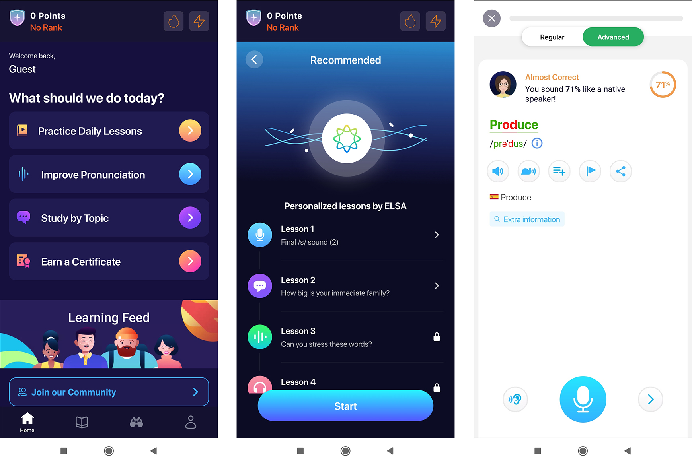

# PEC3: Visionando el futuro con las gafas de Manovich 

Autor: Esther Polo Fernández | Fecha: 17 de diciembre de 2022 

## INTRODUCCIÓN

Tras haber analizado diversos ejemplos de hibridación en el libro *“El software toma el mando”* del teórico y crítico especialista en nuevos medios **Lev Manovich**, en esta PEC03 de la asignatura Cultura Digital, nos llega el turno a nosotros de investigar y escribir un ensayo donde estudiemos dos nuevos casos de hibridación de software de la cultura contemporánea que bien podrían formar parte del libro de Manovich, en el caso de que lo escribiera a día de hoy. Los temas que he elegido para ilustrar la hibridación son el videojuego **Wii Fit** de Nintendo Wii y Wii U y la aplicación para dispositivos móviles y tablets **ELSA Speak**. 

Además, teniendo en cuenta los nuevos formatos de publicación que han ido surgiendo en los últimos años, se ha optado por la realización de un **repositorio en GitHub**, una plataforma de desarrollo colaborativo (*crowdsourcing*) de software, para alojar el proyecto.

## ACERCÁNDONOS AL CONCEPTO DE HIBRIDACIÓN

Antes de meternos de lleno en el análisis de los casos escogidos lo mejor será exponer qué es eso de la hibridación de los medios, de otro modo, será más complicado que podamos ver las cosas a través de las **“gafas de Manovich”**.

Dice Ferran Adell que en “la hibridación […] se da una fusión entre los elementos que comparten las técnicas de software y las interfaces generando una experiencia nueva y coherente, que es diferente a la experimentación de los elementos por separado.”

En el caso de una **hibridación**, lo que obtenemos como resultado es un producto que **combina características de uno y otro medio para crear algo nuevo,** algo que no existía previamente como ocurre por ejemplo en el caso de las inteligencias artificiales que son capaces de generar imágenes a través de un texto que se le indique. Ésta no era una capacidad que poseyeran los medios tradicionales.

>“En los medios híbridos confluyen lenguajes previos y diferenciados. Intercambian propiedades, crean nuevas estructuras e interaccionan a los niveles más profundos.” Manovich, *El Software toma el mando.*

Es común confundir los términos hibridación y **multimedia**, pero con un sencillo ejemplo es probable que veamos todo mucho más claro. Pensemos en la prensa tradicional y en cómo esos periódicos estaban compuestos por textos e imágenes sobre un soporte de papel. Si ahora nos llevamos ese mismo periódico a una versión web, vemos que está formado también por textos e imágenes, pero se le han añadido vídeos y sonidos de forma que la experiencia es mucho más enriquecedora. 

>“En la multimedia diferentes tipos de medios ( texto, audio, vídeo, … ) conviven de forma contigua, y se sitúan -normalmente- en un plano bidimensional” Adell 2004.

Siguiendo con el ejemplo del periódico digital, como resultado seguimos obteniendo las mismas noticias solo que en un formato multimedia en el que cada medio continúa teniendo sus propios controles. En palabras de Manovich, “La palabra «multimedia» supo reflejar el fenómeno de la confluencia de contenidos procedentes de distintos medios, pero no así sus lenguajes.” 

>“En resumen, la «softwarización» de los medios anteriores no conllevó su convergencia», sino que una vez los formatos de representación, las técnicas de creación de contenido y las interfaces de acceso fueron disociados de sus bases físicas y traducidos a software, estos elementos empezaron a interrelacionarse y produjeron nuevos híbridos.” Manovich, *El Software toma el mando.*

Y ahora sí, una vez puesta a la hibridación en su contexto podemos pasar a centrarnos en los casos de estudio que he mencionado en la introducción.

## CASOS DE ESTUDIO

### Caso 1: Wii Fit

Corría el año 2007 cuando la empresa japonesa Nintendo, lanzó al mercado japonés (en el resto del mundo se puso a la venta a lo largo de 2008) el videojuego Wii Fit para la videoconsola Wii.

>Logotipo videojuego Wii Fit.
Haz click en el siguiente enlace para ver el trailer del videojuego de Wii Fit.

https://www.youtube.com/watch?v=Awbg2YZW7EE
___
### Caso 2: ELSA Speak

Cuando nos planteamos mejorar en un idioma, y más concretamente en el caso del inglés, generalmente se nos vienen a la cabeza métodos con los que podamos aprender palabras nuevas y de este modo conseguir ampliar nuestro limitado vocabulario o profundizar más en la gramática y así lograr enriquecer nuestro discurso con expresiones más elaboradas. Sin embargo, un exhaustivo conocimiento de estas destrezas no será suficiente si a la hora de expresarnos en voz alta, nuestra pronunciación no hace justicia a todo ese saber y somos incapaces de conseguir que nuestro interlocutor entienda de qué estamos hablando. 

Por fortuna, no todo está perdido y siempre podremos echar mano de la profesora Elsa. No, no me estoy refiriendo a la protagonista de la película de Disney ni tampoco a ninguna señora nativa angloparlante. Elsa, o mejor escrito ELSA, es el acrónimo de English Language Speech Assistant, un asistente que nos ayudará a perfeccionar nuestra pronunciación del idioma inglés en la aplicación para dispositivos móviles **ELSA Speak**. 

>Logotipo aplicación ELSA Speak.

La ciencia que se esconde detrás de esta aplicación no es otra que una **inteligencia artificial** desarrollada mediante la utilización de datos sonoros de hablantes de inglés con diferentes acentos. Gracias a esta tecnología, ELSA es capaz de reconocer la pronunciación de hablantes cuya lengua materna no es el inglés al contrario que ocurre con muchas tecnologías de reconocimiento de voz creadas previamente. 

Este reconocimiento de voz a tiempo real permite evaluar y dar información inmediata y detallada al alumno acerca de su pronunciación y fluidez identificando así fácilmente dónde se encuentran los errores en su pronunciación. Pero la cosa no queda ahí, puesto que esta inteligencia artificial autoevolutiva **es capaz de analizar el rendimiento y comportamiento del alumno y poder personalizar su plan de estudios diario**. Esto significa que las lecciones se reorganizarán en función de los avances que cada uno vaya logrando.

>Capturas de pantalla de la app ELSA Speak.

Puedes practicar 22 habilidades de pronunciación con diálogos cortos y divertidos gracias a sus **más de 1400 lecciones** breves y motivadoras incrementando su nivel de dificultad. Además, trabajarás tus habilidades tanto orales como de escucha y podrás realizar evaluaciones para tener un registro de tus progresos. También incluye un **diccionario** y un **banco de palabras**.

ELSA Speak dispone de varios paquetes de pago y una versión gratuita de prueba. Lamentablemente sólo está disponible para acento inglés americano neutro, pero a pesar de eso, ELSA Speak es una aplicación diseñada para ayudarte a mejorar la pronunciación del inglés de una forma ágil y divertida.

Haciendo click en el siguiente enlace podrás ver una pequeña guía de uso de ELSA Speak.

https://www.youtube.com/watch?v=5SDqVjYncXY

Después de ésta breve explicación sobre lo que ELSA Speak es capaz de hacer, ya debe de ir quedando más o menos encaminado el por qué la he elegido como mi segundo caso de estudio para ejemplificar el tema de la hibridación de los medios. Y es que tal y como he mencionado en párrafos anteriores, ELSA Speak cuenta con tecnología de última generación basada en una inteligencia artificial. 

El término inteligencia artificial o IA fue acuñado en 1956 por el informático John McCarthy y se emplea para definir una tecnología (sistemas informáticos normalmente) que emula procesos de inteligencia humana incluyendo el aprendizaje, el razonamiento y la autocorrección. 

En el caso de ELSA Speak nos encontramos frente a una app que es capaz de distinguir con bastante precisión los sonidos que emitimos al hablar y asociarlos con los diferentes sonidos y fonemas de la lengua inglesa que tiene guardados en su base de datos y consigue evaluar los sonidos como buenos, regulares o malos. Además, es capaz de interpretar los resultados que vamos obteniendo en los ejercicios y tests y de esta forma reorganizar las lecciones para poder hacer hincapié en nuestros puntos más débiles. Este fenómeno de adaptación no lo encontramos en otras aplicaciones de aprendizaje de idiomas donde no queda más remedio que seguir el método definido por igual para todos los usuarios. En ese sentido, ELSA será lo más parecido a tener un profesor particular de carne y hueso.

## Referencias y Bibliografía

* MANOVICH, L. (2013). “El software toma el mando”. UOCPress
* FERRAN, A. “Técnicas de software, o cómo entender el software” [en línea]. 2014 [consulta: 18 de diciembre 2022] en: http://multimedia.uoc.edu/blogs/fem/es/tecnicas-de-software-o-como-entender-el-software/
* Imagen logotipo Wii Fit https://www.nintendo.es/Juegos/Wii/Wii-Fit-283894.html Propiedad de Nintendo empleado aquí con fines educativos.
* Imagen logotipo ELSA Speak https://www.langoly.com/elsa-speak-review/ Propiedad de ELSA Speak empleado aquí con fines educativos.
* *ELSA Speak* [en línea] [consulta: 18 de diciembre de 2022]. Disponible en: https://elsaspeak.com/es/
* *Reseña de ELSA Speak [en línea] [consulta: 18 de diciembre de 2022]. Disponible en: https://www.alllanguageresources.com/resena-de-elsa-speak/
* WII FIT (WII) TRAILER. *Nintend Life*. Canal de YouTube. https://www.youtube.com/watch?v=Awbg2YZW7EE
* COMPLETE GUIDE: HOW TO USE ELSA SPEAK. *ELSA Speka*. Canal de YouTube. https://www.youtube.com/watch?v=5SDqVjYncXY

----

Licencia: Material Creative Commons desarrollado bajo licencia CC BY-SA 4.0. 
