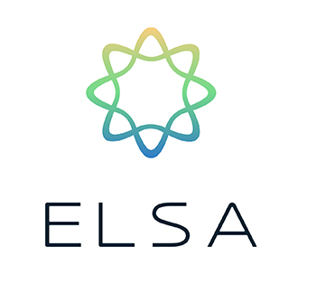

# PEC3: Visionando el futuro con las gafas de Manovich 

Autor: Esther Polo Fernández | Fecha: 17 de diciembre de 2022 

## INTRODUCCIÓN

Tras haber analizado diversos ejemplos de hibridación en el libro “El software toma el mando” del teórico y crítico especialista en nuevos medios Lev Manovich, en esta PEC03 de la asignatura Cultura Digital, nos llega el turno a nosotros de investigar y escribir un ensayo donde estudiemos dos nuevos casos de hibridación de software de la cultura contemporánea que bien podrían formar parte del libro de Manovich, en el caso de que lo escribiera a día de hoy. Los temas que he elegido para ilustrar la hibridación son el videojuego Wii Fit de Nintendo Wii y Wii U y la aplicación ELSA Speak. 

Además, teniendo en cuenta los nuevos formatos de publicación que han ido surgiendo en los últimos años, se ha optado por la realización de un repositorio en GitHub, una plataforma de desarrollo colaborativo (crowdsourcing) de software, para alojar el proyecto.

## ACERCAMIENTO AL CONCEPTO DE HIBRIDACIÓN

Antes de meternos de lleno en el análisis de los casos escogidos lo mejor será exponer qué es eso de la hibridación de los medios, de otro modo, será más complicado que podamos ver las cosas a través de las “gafas de Manovich”.

Y ahora sí, una vez puesta a la hibridación en su contexto podemos pasar a centrarnos en los casos de estudio que he mencionado en la introducción.

## CASOS DE ESTUDIO

### Caso 1: Wii Fit

>Logotipo videojuego Wii Fit

### Caso 2: ELSA Speak

Cuando nos planteamos mejorar en un idioma, y más concretamente en el caso del inglés, generalmente se nos vienen a la cabeza métodos con los que podamos aprender palabras nuevas y de este modo conseguir ampliar nuestro limitado vocabulario o profundizar más en la gramática y así lograr enriquecer nuestro discurso con expresiones más elaboradas. Sin embargo, un exhaustivo conocimiento de estas destrezas no será suficiente si a la hora de expresarnos en voz alta, nuestra pronunciación no hace justicia a todo ese saber y somos incapaces de conseguir que nuestro interlocutor entienda de qué estamos hablando. 

Por fortuna, no todo está perdido y siempre podremos echar mano de la profesora Elsa. No, no me estoy refiriendo a la protagonista de la película de Disney ni tampoco a ninguna señora nativa angloparlante. Elsa, o mejor escrito ELSA, es el acrónimo de English Language Speech Assistant, un asistente que nos ayudará a perfeccionar nuestra pronunciación del idioma inglés en la aplicación para dispositivos móviles ELSA Speak. 

>Logotipo aplicación ELSA Speak

La ciencia que se esconde detrás de esta aplicación no es otra que una inteligencia artificial desarrollada mediante la utilización de datos sonoros de hablantes de inglés con diferentes acentos. Gracias a esta tecnología, ELSA es capaz de reconocer la pronunciación de hablantes cuya lengua materna no es el inglés al contrario que ocurre con muchas tecnologías de reconocimiento de voz creadas previamente. 

Este reconocimiento de voz a tiempo real permite evaluar y dar información inmediata y detallada al alumno acerca de su pronunciación y fluidez identificando así fácilmente dónde se encuentran los errores en su pronunciación. Pero la cosa no queda ahí, puesto que esta inteligencia artificial autoevolutiva es capaz de analizar el rendimiento y comportamiento del alumno y poder personalizar su plan de estudios diario. Esto significa que las lecciones se reorganizarán en función de los avances que cada uno vaya logrando.

Puedes practicar 22 habilidades de pronunciación con diálogos cortos y divertidos gracias a sus más de 1400 lecciones breves y motivadoras incrementando su nivel de dificultad. Además, trabajarás tus habilidades tanto orales como de escucha y podrás realizar evaluaciones para tener un registro de tus progresos. También incluye un diccionario y un banco de palabras.

ELSA Speak dispone de varios paquetes de pago y una versión gratuita de prueba. Lamentablemente sólo está disponible para acento inglés americano neutro, pero a pesar de eso, ELSA Speak es una aplicación diseñada para ayudarte a mejorar la pronunciación del inglés de una forma ágil y divertida.

## Referencias y Bibliografía

* Manovich, Lev. (2013). **El Software toma el mando**. Barcelona: Editorial UOC. 

----

Licencia: Material Creative Commons desarrollado bajo licencia CC BY-SA 4.0. Imágenes CC BY [Tubik studio](https://blog.tubikstudio.com/how-to-create-original-flat-illustrations-designers-tips/) 
